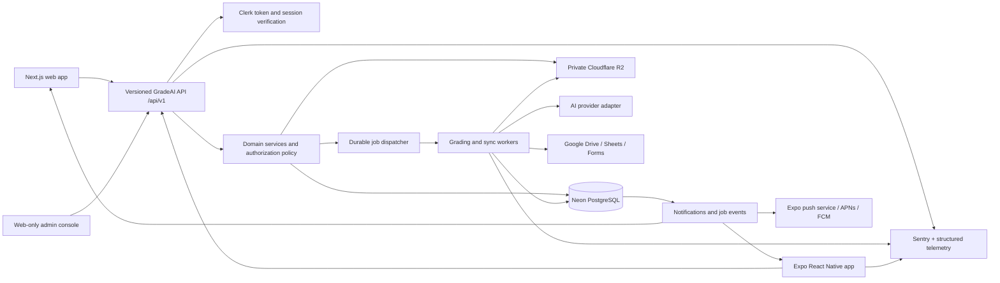

# GradeAI Product, Mobile, Launch, and Long-Term Roadmap

Status: Architecture and execution plan
Date: 2026-07-22
Scope: Existing GradeAI web product, a future Android/iOS teacher app, public launch readiness, and long-term product strategy.

## 1. Executive Decision

GradeAI should not build a second backend for mobile and should never let a mobile client connect directly to Neon.

The target system is:

- One product backend and one Neon PostgreSQL database.
- Two first-class clients: the existing Next.js web app and a native Expo/React Native app.
- One versioned API contract consumed by both clients.
- One durable job system for grading, Google sync, exports, and notifications.
- Shared TypeScript domain logic, Zod contracts, API client, and design tokens.
- Separate UI implementations for web and native. They should have the same brand and interaction language, not force identical DOM/native components.
- The admin console remains web-only until a real mobile admin use case exists.

The correct build order is:

1. Make grading, storage, tenancy, billing, testing, and API contracts production-grade.
2. Extract shared contracts and design tokens.
3. Build the mobile teacher workflow against `/api/v1`.
4. Run a private mobile beta before public app-store release.

Building mobile before steps 1 and 2 would duplicate current backend weaknesses and make every future fix twice as expensive.

## 2. What Exists Today

The repository was audited before writing this plan.

### Strong foundations

- Next.js 16 / React 19 teacher dashboard and marketing site.
- Clerk authentication and server-side admin-role enforcement.
- Neon PostgreSQL and Drizzle ORM migrations.
- Rubric-based AI grading with persisted scores, rationale, usage, and teacher overrides.
- Google Drive, Sheets, and Forms OAuth integration with encrypted tokens.
- Cloudflare R2 file storage through the S3-compatible SDK.
- Classrooms, students, assignments, submissions, grades, reports, analytics, settings, and sync flows.
- Admin users, usage/costs, health, account actions, moderation, audit logs, and Sentry views.
- Sentry instrumentation with privacy filtering.
- MIME allowlisting, size checks, and magic-byte validation for uploads.
- Security headers and basic API rate limiting.

### Partial systems

| Area | Current condition | Required end state |
| --- | --- | --- |
| API contracts | Some clients accept both wrapped and legacy raw responses | One versioned, documented response and error contract |
| Grading jobs | Atomic assignment lock exists, but grading runs inside an HTTP request | Durable jobs with retries, idempotency, item-level progress, and recovery |
| Rate limiting | In-memory per process | Shared distributed limiter across all Railway instances |
| Plans and credits | Fields and admin controls exist | Server-enforced entitlements and an immutable credit ledger |
| Account status | Admin can change it | Every protected API must centrally enforce suspension and deletion states |
| Storage | R2 uploads work, but files can use public URLs | Private objects, direct signed upload/download, quarantine, retention |
| Tenancy | Resources are owned directly by a teacher | Organizations, memberships, roles, invites, and tenant-scoped queries |
| Observability | Sentry and system events exist | SLOs, metrics, traces, alerts, runbooks, and tested incident response |
| Data lifecycle | Clerk deletion and wipe route exist | Export, retention, deletion queue, legal hold policy, and evidence |
| Marketing truth | MVP wording is improved | Every metric, testimonial, price, and capability has provenance |

### Missing release foundations

- No automated unit, API integration, or end-to-end test suite.
- No CI release gate or branch protection evidence in the repository.
- No durable background queue or dedicated worker.
- No billing provider, payment webhooks, invoice flow, or enforced quota.
- No organization/membership data model.
- No public Terms, Privacy, Refund/Cancellation, Acceptable Use, or student-data policy.
- No complete user data export flow.
- No public status page or documented backup/restore drill.
- No complete SEO package: canonical metadata, Open Graph, sitemap, robots, structured data, and social assets.
- No mobile app infrastructure.

The admin console is currently ahead of billing, testing, tenancy, and job reliability. More admin screens should not take priority over those foundations.

## 3. Target Architecture



### Data ownership rule

Only trusted server code can read or write the database. The web and mobile clients send authenticated requests to the same API. This provides one place for:

- Clerk verification.
- organization membership checks.
- suspended-account enforcement.
- plan and credit enforcement.
- validation and sanitization.
- audit logging.
- idempotency and rate limiting.
- privacy filtering.

"Same database" therefore means shared through the same backend contract, not a database credential embedded in an app.

## 4. Repository Shape

Use a monorepo after tests protect the current web app. Keep npm workspaces initially because the repository already uses `package-lock.json`; do not introduce a package-manager migration without a measurable reason. Add Turborepo only for repeatable task orchestration and caching.

```text
gradeai/
|-- apps/
|   |-- web/                    # Existing Next.js app
|   |-- mobile/                 # Expo / React Native teacher app
|   `-- worker/                 # Durable grading and sync execution
|-- packages/
|   |-- contracts/              # Zod request/response/event contracts
|   |-- domain/                 # Pure business rules; no browser/native APIs
|   |-- api-client/             # Typed fetch functions and query keys
|   |-- design-tokens/          # Color, spacing, radius, type, elevation, motion
|   |-- telemetry/              # Shared event names and redaction policy
|   `-- config/                 # Shared TypeScript, ESLint, and test config
|-- docs/
|-- turbo.json
|-- package.json
`-- package-lock.json
```

### Migration order

1. Add CI and baseline tests while the web app remains at the repository root.
2. Create `packages/contracts`, `packages/domain`, and `packages/design-tokens` without moving routes.
3. Move the existing application to `apps/web` in one mechanical change.
4. Verify Railway paths, build command, Sentry source maps, Drizzle migrations, and environment loading.
5. Add `apps/worker` and then `apps/mobile`.

Do not combine the web move, API rewrite, and mobile scaffold in one pull request.

## 5. Mobile Stack

The mobile app should be native Expo/React Native, not a wrapped website. A PWA remains useful for install-free access, but camera capture, resilient uploads, push notifications, secure token storage, and app-store distribution justify native clients.

### Core libraries

| Concern | Library / service | Use |
| --- | --- | --- |
| Runtime | Expo + React Native | Android and iOS application |
| Routing | Expo Router | Typed file-based routes, deep links, native navigation |
| Build/release | EAS Build, Submit, and Update | Signed builds, store submission, controlled OTA updates |
| Authentication | `@clerk/expo` | Same Clerk users and sessions as web |
| Token storage | `expo-secure-store` | Encrypted device storage for Clerk session material |
| Server state | `@tanstack/react-query` | Cache, retries, invalidation, polling, offline-aware reads |
| Local UI state | `zustand` | Selection, drafts, command state, upload state |
| Forms | `react-hook-form`, `zod`, `@hookform/resolvers` | Shared validation and typed forms |
| Motion | `react-native-reanimated`, `react-native-gesture-handler` | Native-thread motion and gestures |
| Icons | `lucide-react-native` | Same icon family as web |
| SVG | `react-native-svg` | Scores, charts, illustrations, progress rings |
| Large lists | `@shopify/flash-list` | Class, assignment, submission, and notification lists |
| Images | `expo-image`, `expo-image-manipulator` | Cached previews and upload preparation |
| Capture | `expo-camera`, `expo-image-picker` | Photograph handwritten work and select images |
| Documents | `expo-document-picker`, `expo-file-system` | PDF/image selection and upload lifecycle |
| Connectivity | `@react-native-community/netinfo` | Offline and reconnect behavior |
| Cache persistence | `@tanstack/query-async-storage-persister`, `@react-native-async-storage/async-storage` | Persist safe query data and drafts |
| Push | `expo-notifications`, `expo-device` | Grading-complete and sync alerts |
| Links/OAuth | `expo-linking`, `expo-web-browser`, `expo-auth-session` | Deep links and system-browser authorization |
| Error monitoring | `@sentry/react-native` | Crashes, releases, traces, and source maps |
| Tests | Vitest, React Native Testing Library, Maestro | Domain/component/E2E coverage |
| Accessibility | React Native accessibility APIs + automated checks | Labels, focus, target size, contrast, reduced motion |
| Analytics charts | `victory-native` only when analytics ships | Native charts; avoid adding it to the MVP bundle early |

Avoid NativeWind/Tailwind. GradeAI already has a semantic CSS-variable design system; the correct cross-platform primitive is shared tokens, not a second styling philosophy.

### Web stack remains unchanged

- Next.js 16, React 19, Server Components, and App Router.
- CSS Modules and CSS custom properties.
- Framer Motion and GSAP.
- Recharts for web analytics.
- Clerk Next.js.
- TanStack Query and Zustand where client state is required.

## 6. Visual Parity Without Fragile Component Sharing

Pixel identity across browser, iPhone, and Android is not a useful target. Native text rendering, safe areas, controls, keyboards, gestures, and accessibility settings differ. The target is unmistakable GradeAI brand parity plus platform-correct behavior.

### Share these tokens

- Semantic colors: background, surface, elevated surface, text, muted text, border, accent, warning, danger, success.
- Type scale, font families, weights, line heights, and letter spacing.
- Spacing scale, radii, borders, and elevation levels.
- Motion durations, easing curves, spring presets, and reduced-motion alternatives.
- Icon sizes and common illustration geometry.
- Breakpoints and density rules where meaningful.

### Do not share these implementations

- HTML/DOM components.
- CSS Modules.
- Framer Motion components.
- React Native views and styles.
- Web tables, hover behavior, native navigation bars, or native sheets.

### Parity process

1. Extract the current design values into `packages/design-tokens/tokens.ts`.
2. Generate web CSS variables from those tokens.
3. Export typed React Native token objects from the same package.
4. Build a web and mobile component gallery for buttons, fields, cards, badges, sheets, dialogs, skeletons, scores, and states.
5. Capture a fixed route/screen matrix in Playwright and Maestro.
6. Review side-by-side on small Android, large Android, iPhone, iPad, laptop, and desktop.
7. Enforce reduced motion, dynamic text, 44-48 px minimum touch targets, visible focus, and contrast.

Motion should communicate hierarchy, progress, and state. Decorative motion must be subtle, cancellable, and disabled when the user requests reduced motion.

## 7. API Contract Shared by Web and Mobile

Use versioned REST first. GraphQL adds schema and caching complexity without solving a current product problem.

### Contract rules

- Prefix stable endpoints with `/api/v1`.
- Define requests, responses, query parameters, and events in shared Zod schemas.
- Return one envelope:

```ts
type ApiSuccess<T> = { success: true; data: T; meta?: ApiMeta };
type ApiFailure = {
  success: false;
  error: { code: string; message: string; fieldErrors?: Record<string, string[]> };
  requestId: string;
};
```

- Use cursor pagination for changing lists and page pagination only for stable admin reports.
- Use stable machine error codes; clients must not branch on human messages.
- Require `Idempotency-Key` for grading, sync, upload finalization, billing, bulk delete, and export creation.
- Include `ETag` or resource versions for conflicting teacher edits.
- Generate an OpenAPI 3.1 artifact in CI from the contracts and check it for breaking changes.
- Keep database row types private. Public DTOs must not expose encrypted tokens, provider payloads, internal prompts, environment values, or moderation-only fields.

### Authentication

- Web: Clerk session cookie verified on the server.
- Mobile: Clerk Expo session obtains a short-lived bearer token; each API request sends it in `Authorization`.
- API: resolve the Clerk user, database user, account state, memberships, and permissions once per request.
- Admin: require both the Clerk metadata role and an active database account on every admin route.
- Never trust a client-supplied teacher ID, organization ID, plan, or role.

### Google authorization on mobile

Use the system browser, PKCE, and a signed one-time state/handoff flow. Refresh tokens remain encrypted on the server and are never returned to the app. Mobile receives only completion/failure through a verified universal/app link. Public use of Google data scopes also requires Google OAuth verification and accurate privacy disclosures.

## 8. Durable Grading and Sync Jobs

The current request-bound grading flow is the highest architectural risk for web and mobile. Mobile backgrounding makes it more visible, but the underlying problem already exists on web.

### Initial decision

Use Trigger.dev managed durable tasks behind a small `JobDispatcher` interface for the first production stage. It provides fast delivery, retries, observability, and long-running execution. If data residency, cost, or throughput later requires self-hosting, implement the same interface with Railway Redis + BullMQ and a dedicated worker.

Do not let route handlers import provider-specific job code directly.

### Job model

Add:

- `grading_jobs`: tenant, assignment, creator, state, progress, model policy, timestamps, idempotency key.
- `grading_job_items`: one row per submission with attempts, state, error code, score/grade reference.
- `job_events`: ordered, user-safe progress messages.
- `dead_letter_jobs`: terminal failures requiring operator action.

### State machine

```text
queued -> validating -> extracting -> grading -> persisting -> completed
   |          |            |           |            |
   `----------+------------+-----------+----------> failed
                                      `----------> partially_completed
```

### Required behavior

- Reserve credits transactionally before accepting work.
- Deduplicate by tenant + operation + idempotency key.
- Retry transient provider, storage, and Google errors with exponential backoff and jitter.
- Never retry validation, unsupported, permission, or exhausted-credit errors blindly.
- Limit per-tenant and global concurrency.
- Allow cancellation before score persistence.
- Recover abandoned work with leases/heartbeats.
- Record prompt, rubric, parser, provider, and model versions.
- Refund reserved credits for work that did not reach a billable boundary.
- Expose `GET /api/v1/jobs/:id` for foreground polling.
- Use push notification on completion; do not rely on a persistent mobile socket.
- Add SSE for a richer foreground web feed only after the job model is stable.

## 9. Files and Uploads

### Target flow

1. Client requests `/api/v1/uploads/presign` with name, claimed MIME, size, and checksum.
2. Server verifies entitlement, assignment ownership, limits, and allowed type.
3. Client uploads directly to a private R2 object using a short-lived signed URL.
4. Client calls `/api/v1/uploads/finalize` with the object key and idempotency key.
5. Server verifies object metadata and signature, queues scanning/extraction, and creates the submission transactionally.
6. Viewing uses short-lived signed download URLs after authorization.

### Required protections

- Private R2 bucket; no hardcoded public fallback URL.
- Store object keys, not permanent public URLs.
- PDF/JPEG/PNG allowlist initially; expand formats only with a tested extraction pipeline.
- 10 MB may remain for MVP, but make it plan-configurable and show client-side guidance.
- Magic-byte validation, decompression limits, page/pixel limits, malware/quarantine scanning, and filename normalization.
- Checksums for deduplication and corruption detection.
- Lifecycle deletion tied to retention policy and account deletion.
- Never place student names, roll numbers, or emails in object keys.

## 10. Offline and Mobile Behavior

Offline support should improve resilience without inventing conflict-prone grading behavior.

### Available offline

- Previously viewed classrooms, assignments, students, grades, and rubric templates.
- New assignment/rubric drafts.
- Teacher notes and review drafts.
- Captured files waiting in a local upload outbox.

### Network required

- Google sync and OAuth.
- AI grading.
- Credit reservation and billing changes.
- Final grade override persistence.
- Admin actions.

### Sync rules

- Every queued mutation has a local UUID/idempotency key.
- Display `saved locally`, `syncing`, `synced`, and `needs attention` explicitly.
- Revalidate authorization and version on reconnect.
- Do not use last-write-wins for grades or rubrics. Show a conflict resolver.
- Encrypt sensitive local state where platform storage supports it; do not persist raw submission files indefinitely.

## 11. Mobile Delivery Stages

### M0 - Backend prerequisites (weeks 1-4)

Deliver:

- CI and test baseline.
- `/api/v1` response/error contract.
- durable grading jobs.
- private R2 signed upload/download.
- central authorization/account/entitlement policy.
- organization and membership groundwork.

Exit criteria:

- A duplicate grading request creates one job.
- A process restart does not lose an accepted job.
- A suspended user and non-member are rejected server-side.
- Every accepted upload is either finalized or automatically expired.
- Web uses the same new endpoints without regression.

### M1 - Native foundation (weeks 5-6)

Deliver:

- Expo app, Expo Router, Clerk, secure token cache, TanStack Query, Zustand, design tokens, Sentry.
- development/staging/production app variants.
- EAS development builds and CI preview builds.
- deep links and authenticated API client.

Exit criteria:

- Sign in/out and token refresh work on physical Android and iOS devices.
- Staging cannot accidentally call production.
- Sentry events are symbolicated and contain no submission text or student PII.

### M2 - Read workflows (weeks 7-8)

Deliver:

- dashboard, classrooms, assignments, submissions, grade detail, notifications, settings.
- skeleton, empty, error, offline, and permission states.
- cached read-only offline access.

Exit criteria:

- Core screens pass accessibility and visual-parity review.
- Lists remain smooth with realistic institute-scale data.
- Deep links open the correct assignment/submission.

### M3 - Capture and submission (weeks 9-10)

Deliver:

- camera/document capture, image correction/compression, upload outbox, direct R2 upload, retry/resume.
- multi-page batch workflow and file preview.

Exit criteria:

- Airplane-mode interruption resumes without duplicate submissions.
- Invalid and oversized files fail before upload with actionable messages.
- No permanent public object URL is exposed.

### M4 - Grade and review (weeks 11-12)

Deliver:

- start grading job, progress feed, completion push, grade review, teacher override, note, and AI chat.
- confidence/needs-review state and evidence display.

Exit criteria:

- Backgrounding or killing the app does not interrupt grading.
- Job status reconciles correctly after relaunch.
- Override and credit operations are idempotent and audited.

### M5 - Private beta (weeks 13-14)

Deliver:

- TestFlight and Play closed testing.
- in-app feedback, support diagnostics, privacy disclosures, store assets, demo account.
- staged rollout and kill switches.

Exit criteria:

- 20-50 invited teachers complete real batches for two weeks.
- Zero known data-loss, cross-tenant, billing, or account-lockout defects.
- Crash-free sessions and grading reliability meet release targets.

### M6 - Store release (week 15+)

Deliver:

- reviewed store metadata, privacy nutrition/data safety declarations, support and deletion URLs.
- signed production builds, staged country rollout, rollback and incident plan.

Do not sell plans inside mobile until the applicable Apple/Google payment rules are reviewed for GradeAI's exact SaaS/B2B flow. Initially, mobile can consume an account entitlement purchased through an approved web or institutional flow. Add RevenueCat only if native in-app purchases become required.

## 12. Public Website Readiness

"Billion-dollar" products are not defined by more cards or animation. Their basics are trust, predictable operations, clear ownership, measurable value, and the ability to recover when systems fail.

### P0 - Blockers before broad public launch

| Priority | Work | Done means |
| --- | --- | --- |
| P0 | Test and CI system | Unit, API integration, migration, and critical Playwright flows gate every merge |
| P0 | Durable jobs | Accepted grading/sync work survives restarts and has retries, progress, and recovery |
| P0 | Tenant model | Organization membership and ownership are enforced in every query and mutation |
| P0 | Entitlements/billing | Plans, credits, reservations, refunds, webhooks, and invoices are server-enforced |
| P0 | Private storage | No permanent public student files; signed access and lifecycle deletion work |
| P0 | AI evaluation | A human-scored benchmark proves acceptable subject/language accuracy and drift alarms |
| P0 | Legal/privacy | Terms, Privacy, DPA, Refund, AUP, student-data policy, retention, export, and deletion are reviewed |
| P0 | OAuth verification | Google consent screen, scopes, redirect URIs, verified domain, and public policy links are approved |
| P0 | Recovery | Automated backups exist and a restore into a clean environment has been tested |
| P0 | Security enforcement | Distributed rate limiting, account suspension, admin MFA, secret rotation, and dependency scanning |
| P0 | Honest product claims | Pricing, metrics, testimonials, model behavior, and limits are factual and traceable |

### P1 - Required for a credible GA product

- Custom product domain, transactional email domain, SPF/DKIM/DMARC, and branded OAuth consent.
- Guided onboarding: first classroom, assignment, rubric, sample submission, and first reviewed grade.
- Integration diagnostics that distinguish OAuth, scope, file, sheet schema, and provider errors.
- Help center, in-product support, support SLA, escalation path, and incident communication templates.
- Public status page with API, grading, Google sync, storage, and auth components.
- SEO: unique metadata, canonical URLs, Open Graph/Twitter assets, sitemap, robots, schema.org data, and clean 404/500 pages.
- Product analytics with a documented event dictionary and consent/privacy controls.
- Accessibility target of WCAG 2.2 AA plus keyboard, screen reader, contrast, zoom, and reduced-motion tests.
- Performance budgets for route JavaScript, LCP, INP, image weight, query count, and list size.
- Feature flags, staged rollout, canary users, rollback, and database migration rollback/forward-fix procedure.
- Data export, account deletion status, retention controls, and institute offboarding.
- Browser/device matrix and documented minimum support policy.

### P2 - Operational maturity for larger institutes

- SSO/SAML and SCIM when customers require them.
- Fine-grained roles: owner, admin, teacher, reviewer, finance, support, read-only auditor.
- IP/session controls, forced logout, device list, admin MFA, and break-glass access.
- Data residency options and customer-specific retention.
- Penetration test, threat model, vendor risk register, and security disclosure program.
- SOC 2 / ISO 27001 readiness only when sales demand it; do not treat badges as security substitutes.
- Load, soak, failure-injection, provider-outage, queue-saturation, and restore exercises.
- Warehouse-quality event pipeline and finance reconciliation.
- Contracted support SLAs, support impersonation with explicit consent, and auditable emergency access.
- Public API, scoped API keys, webhooks, integration marketplace, and sandbox tenant.

## 13. Test and Release System

### Test layers

- `packages/domain`: Vitest property and unit tests for grading arithmetic, rubric weights, credits, roles, status transitions, and deduplication.
- API routes/services: integration tests against an isolated PostgreSQL database with real Drizzle migrations.
- External services: Mock Service Worker or explicit adapters for Clerk, Google, R2, AI, billing, and jobs.
- Web: Playwright for signup/onboarding, assignment creation, sync failure/reconnect, upload, grade, override, billing, deletion, and admin denial.
- Mobile: React Native Testing Library for states and Maestro for sign-in, capture, upload interruption, grading progress, notification deep link, and override.
- AI: versioned golden-set evaluation; do not mock the model for evaluation runs.
- Security: authorization matrix tests attempt cross-user, cross-tenant, suspended, expired-token, replay, and malformed-file access.

### Merge gates

1. Format/lint and strict TypeScript.
2. Unit and integration tests.
3. Drizzle migration validation against an empty and production-like schema.
4. API contract breaking-change check.
5. Web build and mobile type/bundle checks.
6. Dependency/license/secret scans.
7. Preview deployment and critical smoke tests.
8. Required review for auth, billing, migrations, privacy, and grading policy changes.

### Production release

- Feature-flag risky changes.
- Deploy database-compatible code before destructive migrations.
- Canary internal and pilot tenants.
- Watch Sentry, queue, auth, billing, and grading metrics.
- Promote gradually; keep a tested rollback/forward-fix route.
- Write a blameless incident review for every material data, grading, billing, or availability failure.

## 14. AI Accuracy and Trust Program

Accuracy cannot be promised by choosing one model. It must be measured, calibrated, and made reviewable.

### Evaluation dataset

- Build consented, de-identified examples across CBSE, ICSE, and selected state boards.
- Cover Math, Physics, Chemistry, Biology, English, Social Science, Hindi, and mixed-language answers.
- Include typed, clean scans, poor scans, handwriting, diagrams, formulas, tables, and incomplete answers.
- Have at least two qualified educators score a sample and resolve disagreement.
- Separate development, regression, and blind acceptance sets.

### Metrics

- Exact/near score agreement with educator consensus.
- Mean absolute score error and weighted rubric error.
- Severe over-grade and under-grade rate.
- Feedback factuality, usefulness, tone, and curriculum alignment.
- Extraction failure rate by format and image quality.
- Teacher acceptance, override magnitude, regrade, and feedback-edit rate.
- Accuracy slices by subject, grade, language, rubric type, and file type.

### Production policy

- Version prompts, parsers, rubric transformations, model/provider, and reference material.
- Store evidence references and safe rationale, not hidden chain-of-thought.
- Show confidence and route low-confidence or extraction-failed cases to teacher review.
- Sample production output for human quality review with explicit access controls.
- Run the regression suite before any model, prompt, OCR, or rubric-engine change.
- Support model-provider failover only after each provider passes the same acceptance bar.
- Keep the teacher as final decision-maker and preserve all overrides.
- Do not market an AI-detection score as proof of misconduct. Such signals are too uncertain for punitive decisions.

## 15. Billing and Unit Economics

For an India-first launch, use Razorpay for web subscriptions/payments and verified webhooks, with a provider-neutral billing service so Stripe or another provider can be added for international markets.

### Required ledger model

- `billing_customers` and `subscriptions`.
- `plans` and versioned plan prices/limits.
- append-only `credit_ledger` entries: grant, reserve, consume, release, refund, adjustment, expiry.
- `billing_webhook_events` with provider event ID uniqueness and processing state.
- invoices, GST fields, tax evidence, payment status, and reconciliation IDs.

Never implement credits as a mutable counter alone. The current counter can remain as a cached balance derived from the ledger.

### Per-submission economics

Track:

```text
contribution margin per submission
= realized revenue
- AI input/output tokens
- OCR/document processing
- storage and egress
- job/compute cost
- payment fees and taxes borne by GradeAI
- expected support and refund allowance
```

Dashboard this by plan, subject, file type, model, and customer cohort. Set an initial software gross-margin target, then price from observed data rather than an invented flat average.

## 16. Security, Privacy, and Student Data

This product stores education records and may process children's data. Security and privacy are product functionality, not footer text.

### Immediate controls

- Engage Indian privacy counsel for the DPDP Act/Rules and children's-data obligations; this document is not legal advice.
- Minimize student data: allow institute-local identifiers and make parent phone/email optional.
- Record the teacher/institute's authority and applicable consent basis.
- Define purpose, retention, export, correction, deletion, breach, and grievance processes.
- Redact submission text, names, emails, tokens, and file URLs from logs, analytics, Sentry, and prompts where not required.
- Keep Google scopes minimal and explain each scope at consent time.
- Encrypt secrets/tokens at rest with key-version rotation and audited decrypt access.
- Enforce tenant isolation in the service layer and test it automatically.
- Add a content/report workflow without giving support staff unrestricted browsing.
- Publish a subprocessor list and change-notification process.

### Security program growth

- Use OWASP ASVS as the verification backlog.
- Quarterly dependency and access review.
- Annual independent penetration test once meaningful customer data exists.
- Vulnerability intake/security contact and response SLA.
- Incident severity model, notification decision tree, evidence preservation, and tabletop exercise.
- Business continuity targets for database, storage, auth, AI provider, Google, billing, and queue outages.

## 17. Product Metrics

### North-star metric

Weekly active teachers who complete and review at least one real grading batch.

This measures the full value loop, not logins or AI calls.

### Supporting metrics

| Category | Metrics |
| --- | --- |
| Activation | Signup to first classroom, first synced/uploaded submission, first reviewed batch |
| Value | Median teacher minutes saved per 30 submissions, turnaround time, batches per teacher |
| Trust | Grade acceptance, mean override, feedback edit, regrade, complaint, low-confidence rate |
| Reliability | Job success, p50/p95 completion time, stuck jobs, sync failures, lost/duplicate submissions |
| Retention | Week 1/4/12 teacher and institute retention, active seats per institute |
| Growth | Qualified leads, pilot-to-paid conversion, referrals, expansion revenue |
| Economics | Cost and contribution margin per submission, gross margin per plan, support cost per account |
| Guardrails | Privacy incidents, cross-tenant attempts, incorrect-grade escalations, deletion SLA |

Every dashboard metric must define its source, owner, denominator, freshness, and action threshold.

## 18. Product Wedge and Moat

### Initial ideal customer

Focus on Indian coaching institutes and small-to-medium schools with repeated paper/form-based assignments, multiple teachers, and enough volume to feel grading pain. A 5-50 teacher institute is a stronger design partner than a broad consumer audience because the workflow repeats and the buyer can measure time saved.

### Wedge

Fast, auditable batch grading from Google Forms, PDFs, images, and text, with teacher-controlled rubrics and overrides.

### Expansion

- assignment and question authoring.
- shared rubric/template library.
- moderation and second-review workflows.
- curriculum and board-aligned content packs.
- progress reports, intervention groups, and parent/student communication.
- institute operations and integration APIs.

### Defensible advantages

- Consented, de-identified teacher-correction data used for evaluation and calibration.
- Deep localization for Indian boards, subjects, languages, and assessment styles.
- Trust: evidence, versions, audit, reproducibility, and teacher authority.
- Workflow distribution through Google, LMS, SIS, and institute integrations.
- A high-quality rubric/template network with expert provenance.
- Historical analytics that customers can always export; retention should come from value, not data lock-in.

The model provider is not the moat. Models will change. GradeAI's evaluation system, workflow, curriculum graph, correction signals, and institutional trust can compound.

## 19. Feature Roadmap

### Tomorrow through day 7 - Stabilize the truth

- Freeze unsupported claims, fake counters, fabricated testimonials, and unimplemented pricing promises.
- Decide invite-only beta positioning and one ideal customer profile.
- Add the first unit/integration/Playwright tests and GitHub Actions gates.
- Document production architecture, environments, migrations, backups, and incident contacts.
- Remove any public R2 fallback and audit all existing object visibility.
- Centralize account status, role, ownership, and plan enforcement.
- Create grading benchmark v0 from educator-reviewed examples.
- Draft legal/privacy/data-retention documents with counsel.
- Define activation, trust, reliability, and cost event schemas.
- Recruit 5-10 design-partner teachers; observe real grading sessions.

### Days 8-30 - Private production beta

- Ship durable grading/sync jobs, job events, retries, and recovery.
- Implement private R2 direct uploads and signed downloads.
- Add append-only credits and Razorpay sandbox/webhook flow.
- Finish organization/membership schema and migration strategy.
- Complete critical test matrix and CI release gates.
- Build guided onboarding and Google integration diagnostics.
- Add support, status, privacy, terms, deletion/export request, and honest pricing pages.
- Run load tests with realistic 30/100/500-submission batches.
- Measure model quality and unit economics on pilot traffic.
- Start `packages/contracts`, `domain`, and `design-tokens`; do not start full mobile UI yet.

### Months 2-3 - Productize and begin mobile

- Enforce organizations, memberships, roles, invitations, and tenant audit.
- Launch paid web plans only after ledger and webhook reconciliation tests pass.
- Move to monorepo, add worker, and expose stable `/api/v1` contracts.
- Build M1-M3 mobile stages: auth, read workflows, camera/doc upload, offline cache.
- Add push notifications and universal links.
- Add multilingual UI foundation with English and Hindi first.
- Add rubric template packs for the first validated subjects/boards.
- Improve OCR/extraction quality gates and teacher review tools.

### Months 4-6 - Mobile beta and institute workflows

- Ship private Android/iOS beta, then staged store release.
- Add batch capture, page ordering, crop/quality guidance, and resume.
- Add department-level rubric sharing, reviewer assignment, and moderation.
- Add institute analytics: turnaround, rubric consistency, intervention groups, and usage economics.
- Integrate one priority LMS/SIS based on signed customer demand.
- Add parent/student report exports with explicit sharing controls.
- Run independent security review and restore/tabletop exercise.

### Months 7-18 - India assessment platform

- Expand board, grade, subject, and language coverage based on evaluation readiness.
- Add question bank, paper generation, answer-key/rubric co-authoring, and version control.
- Add human moderation queues and double-mark sampling.
- Add model routing by task, cost, latency, and measured quality.
- Add institutional SSO, advanced roles, API/webhooks, and data warehouse export where demanded.
- Add teacher communities and expert-verified template marketplace.
- Add formative insights: misconceptions, concept mastery, reteaching groups, and progress narratives.
- Add accessible student feedback experiences without making automated decisions final.

### Years 2-5 - Assessment operating system

- Curriculum knowledge graph connecting standards, concepts, questions, rubrics, evidence, and interventions.
- Adaptive practice generated from verified gaps, with teacher approval.
- Multimodal support for equations, diagrams, lab work, oral responses, and regional handwriting.
- Institute/district benchmarking with strict aggregation and privacy thresholds.
- Partner platform for publishers, coaching networks, LMS/SIS vendors, and education services.
- Enterprise deployment options, data residency, private model endpoints, and controlled-key integrations.
- Research partnerships that publish transparent evaluation methods rather than marketing-only accuracy claims.

### Years 5-10 - Regional platform

- Expand to markets with similar multilingual, exam-heavy workflows only after local curriculum partners exist.
- Standards-based assessment exchange and long-lived learner evidence portfolios.
- Educator marketplace for verified rubrics, questions, interventions, and moderation.
- Federated/private analytics where institutions cannot pool raw student data.
- On-premise or sovereign-cloud options for regulated customers when economics justify them.
- Mature partner APIs, certification, and ecosystem revenue.

### Years 10-30 - Durable principles, not fictional feature guesses

Technology, regulation, devices, and education will change too much for a credible 30-year feature list. Preserve these architectural and product invariants:

- Teacher/institution remains accountable for high-impact decisions.
- Every grade remains reproducible from versioned evidence and policy.
- AI providers are replaceable adapters, never the product identity.
- Data has explicit provenance, retention, consent, export, and deletion behavior.
- Contracts and standards outlive UI frameworks.
- Customers can migrate their data without losing meaning.
- Privacy-preserving learning improves the product without exploiting children.
- Accessibility, language, and low-connectivity support are default constraints.
- New modalities are admitted only after measurable evaluation.
- Archive formats and migration tools preserve decades of records.
- The company earns trust through transparent limitations and fast correction, not certainty theater.

## 20. Features to Avoid or Delay

- Do not build a general student social network before moderation, consent, and child-safety capacity exist.
- Do not use AI-detection output for punishment or market it as proof.
- Do not add blockchain, tokens, or credentials without a verified interoperability problem.
- Do not train on customer/student content by default.
- Do not add a second database per client.
- Do not split into microservices before ownership, load, and team boundaries require it.
- Do not add GraphQL, WebSockets, Kubernetes, or a data warehouse merely to look mature.
- Do not support every board, subject, language, and file format before each has an evaluation set.
- Do not put full billing administration or the owner admin console into mobile initially.
- Do not make visual motion compete with grading status, readability, or reduced-motion settings.
- Do not promise exact scores; promise a controlled, auditable teacher-review workflow.

## 21. Operating Process

### Product discovery

- Weekly: observe at least two real grading sessions and review override reasons.
- Biweekly: prioritize one measurable workflow problem, not a list of requested features.
- Monthly: review cohort retention, accuracy slices, reliability, margin, and support themes.
- Quarterly: update product risk register, curriculum coverage, pricing, and roadmap.

### Engineering delivery

1. Short RFC for auth, data, billing, queue, grading, privacy, or public contract changes.
2. Threat/data-flow review and measurable acceptance criteria.
3. Tests first for critical policy and money paths.
4. Small implementation behind a feature flag.
5. Preview and pilot verification with realistic data.
6. Staged production rollout with dashboards and rollback.
7. Outcome review against product and reliability metrics.

### Decision standard

For major choices, record:

- scalability and future migration cost.
- delivery speed and operational burden.
- data integrity, privacy, and attack surface.
- teacher/student experience and accessibility.
- runtime, bundle, provider, and support cost.

An architecture decision record should state the choice, rejected alternatives, assumptions, review date, and reversal trigger.

## 22. Team Sequence

The exact hiring pace depends on revenue, but the capability order should be:

1. Founder/product owner plus senior full-stack ownership of reliability and contracts.
2. Fractional teacher/curriculum experts for benchmarks and rubric quality.
3. Fractional privacy counsel and accountant/tax expertise before paid public launch.
4. Product-minded mobile engineer when M0 backend prerequisites are underway.
5. QA/automation and customer-success ownership before broad app-store growth.
6. Security/data/ML specialists when customer volume and enterprise sales justify dedicated roles.

Do not solve missing process by hiring many feature developers. One strong release system and clear product evidence outperform a larger uncoordinated team.

## 23. Go/No-Go Gates

### Public web beta

- No open cross-tenant, data-loss, billing, or account-lockout defect.
- Restore drill completed and timed.
- Grading jobs survive deployment/restart.
- Terms/privacy/deletion/support routes are live.
- Google verification and production credentials are correct.
- Benchmark and pilot teachers support the claimed scope.
- Pricing and limits are enforced, not decorative.

### Paid general availability

- Payment webhook replay and reconciliation tests pass.
- Credits reserve/consume/refund correctly under concurrency.
- Support and incident response have named owners.
- Reliability and margin targets hold for at least four beta weeks.
- Accessibility and security launch reviews are complete.

### Mobile store launch

- Web API is stable and versioned.
- App privacy/data-safety declarations match actual SDK/network behavior.
- Demo/review account and backend remain available during review.
- Account deletion can be initiated without support intervention.
- Auth, upload, grading, background/resume, push, and deep links pass on physical devices.
- Staged rollout, remote kill switch, and rollback are tested.

## 24. The Next 90 Days in One View

| Window | Primary outcome | Do not dilute with |
| --- | --- | --- |
| Week 1 | Truthful, testable private beta baseline | More dashboard decoration |
| Weeks 2-4 | Durable jobs, private files, contracts, entitlements, legal/support basics | Full mobile screens |
| Weeks 5-6 | Tenancy and monorepo foundation; mobile auth/design system | Broad curriculum expansion |
| Weeks 7-10 | Mobile read/capture workflows and web billing beta | Enterprise certifications |
| Weeks 11-12 | Mobile grading/review, push, offline recovery | Social/community features |
| Weeks 13+ | Pilot evidence, fixes, staged store beta | Premature country expansion |

## 25. Architectural Decision Summary

| Decision | Choice | Why | Reversal trigger |
| --- | --- | --- | --- |
| Mobile client | Expo/React Native | Native capture, push, secure storage, strong TypeScript reuse | A required native capability is unsupported after a measured spike |
| Repository | npm workspaces + Turborepo | Preserve current lockfile while sharing contracts/tokens | Tooling materially blocks builds or deterministic installs |
| Data access | Same API, one Neon database | One authority for auth, billing, privacy, and business rules | Regulatory isolation requires regional databases |
| API | Versioned REST + Zod + OpenAPI artifact | Fits current Next routes and mobile caching with low complexity | Partner query needs repeatedly cannot be served cleanly |
| UI sharing | Shared tokens, separate components | Preserves brand while respecting native behavior | A proven cross-platform primitive reduces more complexity than it adds |
| Jobs | Trigger.dev behind adapter | Fast durable execution and observability | Cost, residency, throughput, or vendor reliability breaches thresholds |
| Realtime | Poll job status + completion push; optional web SSE | Reliable through mobile backgrounding and simple to recover | Foreground UX data proves lower latency is necessary |
| Storage | Private R2 + direct presigned transfer | Protect student files and remove server upload bottleneck | Customer residency/compliance requires another object store |
| Billing | Razorpay first, provider-neutral ledger | India-first collections without coupling entitlement logic | International revenue or store rules require another provider |
| Admin | Web-only | Highest information density and smallest attack surface | Repeated, validated mobile operator workflows emerge |

## 26. Primary References

- [Expo monorepo guidance](https://docs.expo.dev/guides/monorepos/)
- [Expo Router introduction](https://docs.expo.dev/router/introduction/)
- [EAS Build](https://docs.expo.dev/build/introduction/)
- [EAS Update](https://docs.expo.dev/eas-update/introduction/)
- [Expo push notifications](https://docs.expo.dev/push-notifications/overview/)
- [Expo and Sentry](https://docs.expo.dev/guides/using-sentry/)
- [Clerk Expo quickstart](https://clerk.com/docs/expo/getting-started/quickstart)
- [Google OAuth for installed applications](https://developers.google.com/identity/protocols/oauth2/native-app)
- [Cloudflare R2 presigned URLs](https://developers.cloudflare.com/r2/api/s3/presigned-urls/)
- [Trigger.dev durable task documentation](https://trigger.dev/docs/introduction)
- [Razorpay Subscriptions](https://razorpay.com/docs/payments/subscriptions/)
- [Apple App Review Guidelines](https://developer.apple.com/app-store/review/guidelines/)
- [Google Play data-use declaration](https://developer.android.com/privacy-and-security/declare-data-use)
- [India Digital Personal Data Protection Rules, 2025](https://www.meity.gov.in/documents/act-and-policies/digital-personal-data-protection-rules-2025-gDOxUjMtQWa)
- [WCAG 2.2](https://www.w3.org/TR/WCAG22/)
- [OWASP Application Security Verification Standard](https://owasp.org/www-project-application-security-verification-standard/)

## 27. Final Priority

The highest-leverage GradeAI roadmap is not "more AI features." It is:

1. Prove grading trust with educator-reviewed evaluation.
2. Make accepted work durable and student files private.
3. Enforce tenants, entitlements, billing, and account state centrally.
4. Create one versioned contract for web and mobile.
5. Build the native capture/review loop.
6. Grow through real institute outcomes, curriculum depth, and workflow integrations.

If those six compound, GradeAI can evolve from a grading tool into an assessment operating system. If they are skipped, additional features will increase support cost faster than product value.
